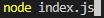
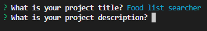
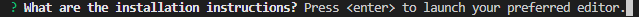
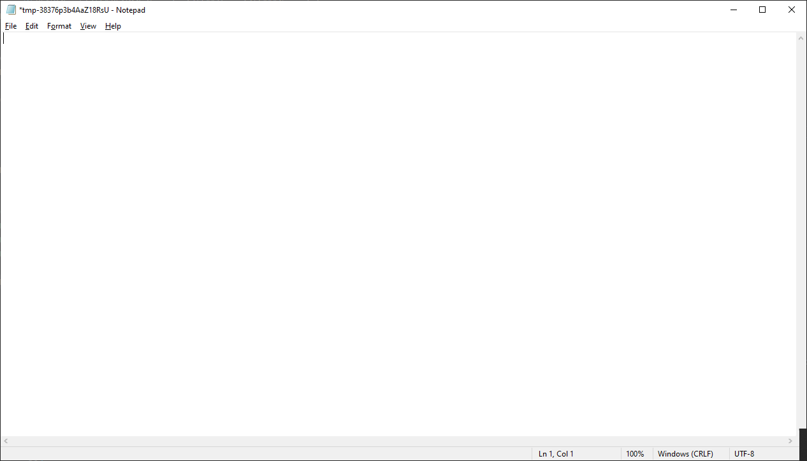
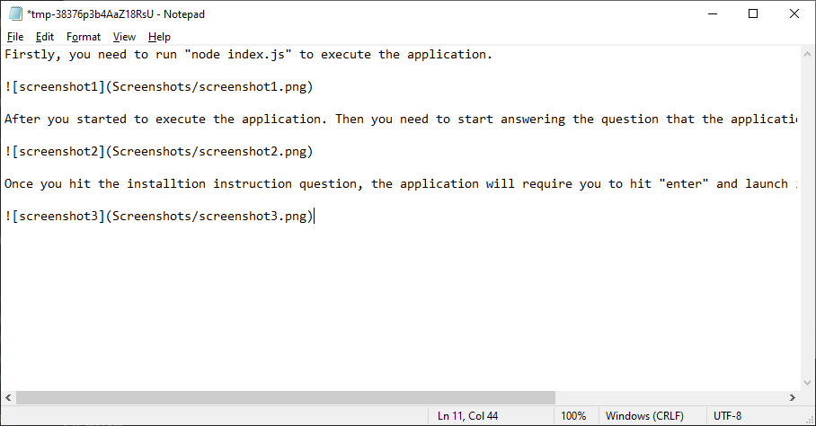
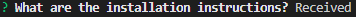
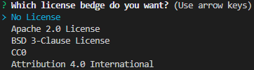
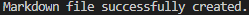

# README-Generator

A CLI application that creates Generate README files

## Description

This application built upon command line interface using a JavaScript framework (Node.Js) with a node module called inquirer to create prompts and input questons to create a markdown/readme file for your personal projects.

## Table of Content

  - [Feature](#feature)
  - [Installation](#installation)
  - [Usage](#usage)
  - [Credits](#credits)
  - [License](#license)

## Feature

Create a Markdown file which suits your personal project needs.

## Installation

Step 1: Clone the repo (HTTPS: `git clone https://github.com/louieiply/readme-Generator.git` or SSH: `git clone git@github.com:louieiply/readme-Generator.git`)

Step 2: Install Node.js

Step 3: npm i inquirer (to install inquire node library)

## Usage

### Video

Here is a URL of a 
[Demonstration Video](https://youtu.be/GtR4Ozvaats)

### Screenshot

Firstly, you need to run "node index.js" to execute the application.

After you started to execute the application. Then you need to start answering the question that the application asked.

Once you hit the installtion instruction question, the application will require you to hit "enter" and launch into your preferred editor to edit your sesion.

Once you hit "enter" a text editor will show up. Then you can start add your comments.

Once you have finish your comments. You need to save the file in order to save your progress.

This message will show up when you finished your edit in the text editor

The application will ask you whether to include a License for your project. (Choose No Lincese if you don't need one)

After you finished the application a message will show up.

## Credits

Github, shield.io, inquirer.js - npm.js

## License
[MIT License - Copyright (c) 2022 Louie Ip](./LICENSE)

